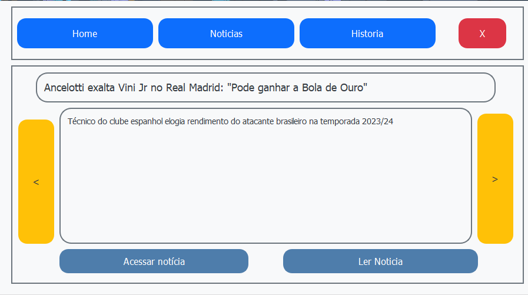

# App_Futebol 
 
 <div align="center">



</div>
<br>

> Projeto desenvolvido durante o periodo do curso
Ténico em Desenvolvimento de Sistema no `Senac Sorocaba`.

## 💻 Pré-requisitos

Antes de começar, verifique se você atendeu aos seguintes requisitos:

- Você instalou a versão mais recente de `Python 3.12`
- Você tem uma máquina `Windows | Linux | MacOS`.
  
- Configurado o Ambiente Virtual:
  - `python -m venv env` | | `python3 -m venv env`
  
- Instalação das dependendias:
    - `PyQt5`
    - `Requests `
    - `BeautifulSoup4 `
    - `Auto-Py-To-Exe`

### Ajustes e melhorias

O projeto ainda está em desenvolvimento e as próximas atualizações serão voltadas nas seguintes tarefas:

- [X] Interface Gráfica
- [X] Layout do App
- [X] Web Scraping
- [X] Ajustar tamanho da fonte do display
- [X] Melhorias na Interface Gráfica

## 🚀 Instalando App_Futebol

Para instalar o App_Futebol, siga estas etapas:

Windows:
```
python -m venv env
env\Scripts\Activate.ps1
python -m pip install pyqt5
python -m pip install requests
python -m pip install BeautifulSoup4
python -m pip install auto-py-to-exe
```
MacOS | Linux:
```
python3 -m venv env
source env/bin/activate
python3 -m pip install pyqt5
python3 -m pip install requests
python3 -m pip install BeautifulSoup4
python3 -m pip install auto-py-to-exe

```

## ☕ Usando o App_Futebol

Para usar o App_Futebol, siga estas etapas:

```
python main.py  ||  python3 main.py
```

## 📫 Contribuindo para o App_Futebol

Para contribuir com App_Futebol, siga estas etapas:

1. Bifurque este repositório.
2. Crie um branch: `git checkout -b App_futebol`.
3. Faça suas alterações e confirme-as: `git commit -m '<mensagem_commit>'`
4. Envie para o branch original: `git push origin <nome_do_projeto> / <local>`
5. Crie a solicitação de pull.

Como alternativa, consulte a documentação do GitHub em [como criar uma solicitação pull](https://help.github.com/en/github/collaborating-with-issues-and-pull-requests/creating-a-pull-request).

## 🤝 Colaboradores

Agradecemos às seguintes pessoas que contribuíram para este projeto:

<table style="float: left;">
  <tr>
    <td align="left">
      <a href="#" title="Bruno Mendes">
        <br>
      </a>
    </td>
  </tr>
</table>
<table style="float: center;">
  <tr>
    <td align="center">
      <a href="#" title="Nickolas">
        <br>
      </a>
    </td>
  </tr>
<table>
  <tr>
    <td align="center">
      <a href="#" title="Vitor">
        <br>
      </a>
    </td>
  </tr>
</table>
<br><br>

## 😄 
 
## 📝 Licença
Em Desenvolvimento..... 🛠️